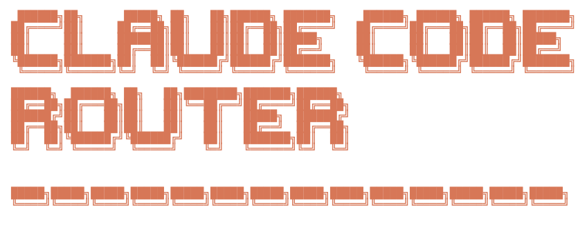

[](README_zh.md)
[](https://discord.gg/rdftVMaUcS)
[](https://github.com/musistudio/claude-code-router/blob/main/LICENSE)

<hr>

I am seeking funding support for this project to better sustain its development. If you have any ideas, feel free to reach out to me: [m@musiiot.top](mailto:m@musiiot.top)

> A powerful tool to route Claude Code requests to different models and customize any request.

> Now you can use models such as `GLM-4.5`, `Kimi-K2`, `Qwen3-Coder-480B-A35B`, and `DeepSeek v3.1` for free through the [iFlow Platform](https://platform.iflow.cn/docs/api-mode).
> You can use the `ccr ui` command to directly import the `iflow` template in the UI. It’s worth noting that iFlow limits each user to a concurrency of 1, which means you’ll need to route background requests to other models.
> If you’d like a better experience, you can try [iFlow CLI](https://cli.iflow.cn).


## ✨ Features

- **Model Routing**: Route requests to different models based on your needs (e.g., background tasks, thinking, long context).
- **Multi-Provider Support**: Supports various model providers like OpenRouter, DeepSeek, Ollama, Gemini, Volcengine, and SiliconFlow.
- **Request/Response Transformation**: Customize requests and responses for different providers using transformers.
- **Dynamic Model Switching**: Switch models on-the-fly within Claude Code using the `/model` command.
- **GitHub Actions Integration**: Trigger Claude Code tasks in your GitHub workflows.
- **Plugin System**: Extend functionality with custom transformers.
- **Advanced Cleanup Management**: Intelligent cleanup of log files, PID files, and backups with configurable retention policies.
- **Improved Architecture**: Well-organized codebase with modular utilities, centralized cleanup management, and comprehensive test coverage.

## 🚀 Getting Started

### 1. Prerequisites

- Node.js (v16 or higher)
- npm or yarn
- Claude Code CLI (optional, for testing)
- Ollama (optional, for local model support)

### 2. Installation

First, ensure you have [Claude Code](https://docs.anthropic.com/en/docs/claude-code/quickstart) installed:

```shell
npm install -g @anthropic-ai/claude-code
```

Then, install Claude Code Router:

```shell
npm install -g @musistudio/claude-code-router
```

Or install from source:

```bash
git clone https://github.com/musistudio/claude-code-router.git
cd claude-code-router
npm install
npm run build
```

### 2. Configuration

Create and configure your `~/.claude-code-router/config.json` file. For more details, you can refer to `config.example.json`.

The `config.json` file has several key sections:

- **`PROXY_URL`** (optional): You can set a proxy for API requests, for example: `"PROXY_URL": "http://127.0.0.1:7890"`.
- **`LOG`** (optional): You can enable logging by setting it to `true`. When set to `false`, no log files will be created. Default is `true`.
- **`LOG_LEVEL`** (optional): Set the logging level. Available options are: `"fatal"`, `"error"`, `"warn"`, `"info"`, `"debug"`, `"trace"`. Default is `"debug"`.
- **Logging Systems**: The Claude Code Router uses two separate logging systems:
  - **Server-level logs**: HTTP requests, API calls, and server events are logged using pino in the `~/.claude-code-router/logs/` directory with filenames like `ccr-*.log`
  - **Application-level logs**: Routing decisions and business logic events are logged in `~/.claude-code-router/claude-code-router.log`
- **`APIKEY`** (optional): You can set a secret key to authenticate requests. When set, clients must provide this key in the `Authorization` header (e.g., `Bearer your-secret-key`) or the `x-api-key` header. Example: `"APIKEY": "your-secret-key"`.
- **`HOST`** (optional): You can set the host address for the server. If `APIKEY` is not set, the host will be forced to `127.0.0.1` for security reasons to prevent unauthorized access. Example: `"HOST": "0.0.0.0"`.
- **`NON_INTERACTIVE_MODE`** (optional): When set to `true`, enables compatibility with non-interactive environments like GitHub Actions, Docker containers, or other CI/CD systems. This sets appropriate environment variables (`CI=true`, `FORCE_COLOR=0`, etc.) and configures stdin handling to prevent the process from hanging in automated environments. Example: `"NON_INTERACTIVE_MODE": true`.

- **`Providers`**: Used to configure different model providers.
- **`Router`**: Used to set up routing rules. `default` specifies the default model, which will be used for all requests if no other route is configured.
- **`API_TIMEOUT_MS`**: Specifies the timeout for API calls in milliseconds.

## 🦙 Ollama Integration

The Claude Code Router includes comprehensive Ollama support for running AI models locally, providing cost-effective and private AI inference.

### Ollama Setup

#### 1. Install Ollama

```bash
# macOS (using Homebrew)
brew install ollama

# Linux
curl -fsSL https://ollama.ai/install.sh | sh

# Windows
# Download from: https://ollama.ai/download
```

#### 2. Start Ollama Service

```bash
# Start Ollama (runs in background)
ollama serve

# Verify it's running
ollama list
```

#### 3. Pull Recommended Models

```bash
# General purpose model - fast and versatile
ollama pull llama3.2:latest

# Coding specialist - optimized for programming tasks
ollama pull qwen2.5-coder:latest

# Advanced reasoning (optional - large model)
ollama pull deepseek-coder-v2:latest
```

### Performance Characteristics

| Model | Simple Query | Medium Query | Complex Query | Cost |
|-------|-------------|--------------|---------------|------|
| **Ollama Llama 3.2** | 489ms | 857ms | 863ms | **$0** |
| **Ollama Qwen 2.5 Coder** | 800ms | 1,329ms | 1,436ms | **$0** |
| **Groq Llama 3.1 70B** | ~200-400ms | ~400-800ms | ~800-1200ms | $0.00059/1K |
| **DeepSeek Chat** | ~300-500ms | ~500-900ms | ~900-1500ms | $0.00014/1K |

#### Cost Efficiency
| Model | Cost per 1000 tokens | Annual Savings (100K tokens) |
|-------|----------------------|------------------------------|
| **Ollama Models** | **$0.00** | **$0** |
| **DeepSeek** | $0.00014 | ~$14 |
| **Groq** | $0.00059 | ~$59 |
| **GPT-3.5** | $0.002 | ~$200 |

### Model Recommendations

1. **General Conversation**: `ollama,llama3.2:latest`
   - Fastest response times
   - Excellent for casual queries
   - Zero cost

2. **Coding Tasks**: `ollama,qwen2.5-coder:latest`
   - Specialized for programming
   - Better code generation quality
   - Still zero cost

3. **Complex Reasoning**: `deepseek,deepseek-reasoner`
   - Best balance of cost vs capability
   - Excellent for analysis and reasoning

4. **Creative Writing**: `anthropic,claude-3-5-sonnet-20241022`
   - Superior creative output
   - Best for writing and content creation

#### Environment Variable Interpolation

Claude Code Router supports environment variable interpolation for secure API key management. You can reference environment variables in your `config.json` using either `$VAR_NAME` or `${VAR_NAME}` syntax:

```json
{
  "OPENAI_API_KEY": "$OPENAI_API_KEY",
  "GEMINI_API_KEY": "${GEMINI_API_KEY}",
  "Providers": [
    {
      "name": "openai",
      "api_base_url": "https://api.openai.com/v1/chat/completions",
      "api_key": "$OPENAI_API_KEY",
      "models": ["gpt-5", "gpt-5-mini"]
    }
  ]
}
```

This allows you to keep sensitive API keys in environment variables instead of hardcoding them in configuration files. The interpolation works recursively through nested objects and arrays.

Here is a comprehensive example:

```json
{
  "APIKEY": "your-secret-key",
  "PROXY_URL": "http://127.0.0.1:7890",
  "LOG": true,
  "API_TIMEOUT_MS": 600000,
  "NON_INTERACTIVE_MODE": false,
  "Providers": [
    {
      "name": "openrouter",
      "api_base_url": "https://openrouter.ai/api/v1/chat/completions",
      "api_key": "sk-xxx",
      "models": [
        "google/gemini-2.5-pro-preview",
        "anthropic/claude-sonnet-4",
        "anthropic/claude-3.5-sonnet",
        "anthropic/claude-3.7-sonnet:thinking"
      ],
      "transformer": {
        "use": ["openrouter"]
      }
    },
    {
      "name": "deepseek",
      "api_base_url": "https://api.deepseek.com/chat/completions",
      "api_key": "sk-xxx",
      "models": ["deepseek-chat", "deepseek-reasoner"],
      "transformer": {
        "use": ["deepseek"],
        "deepseek-chat": {
          "use": ["tooluse"]
        }
      }
    },
    {
      "name": "ollama",
      "api_base_url": "http://localhost:11434/v1/chat/completions",
      "api_key": "ollama",
      "models": ["qwen2.5-coder:latest"]
    },
    {
      "name": "gemini",
      "api_base_url": "https://generativelanguage.googleapis.com/v1beta/models/",
      "api_key": "sk-xxx",
      "models": ["gemini-2.5-flash", "gemini-2.5-pro"],
      "transformer": {
        "use": ["gemini"]
      }
    },
    {
      "name": "volcengine",
      "api_base_url": "https://ark.cn-beijing.volces.com/api/v3/chat/completions",
      "api_key": "sk-xxx",
      "models": ["deepseek-v3-250324", "deepseek-r1-250528"],
      "transformer": {
        "use": ["deepseek"]
      }
    },
    {
      "name": "modelscope",
      "api_base_url": "https://api-inference.modelscope.cn/v1/chat/completions",
      "api_key": "",
      "models": ["Qwen/Qwen3-Coder-480B-A35B-Instruct", "Qwen/Qwen3-235B-A22B-Thinking-2507"],
      "transformer": {
        "use": [
          [
            "maxtoken",
            {
              "max_tokens": 65536
            }
          ],
          "enhancetool"
        ],
        "Qwen/Qwen3-235B-A22B-Thinking-2507": {
          "use": ["reasoning"]
        }
      }
    },
    {
      "name": "dashscope",
      "api_base_url": "https://dashscope.aliyuncs.com/compatible-mode/v1/chat/completions",
      "api_key": "",
      "models": ["qwen3-coder-plus"],
      "transformer": {
        "use": [
          [
            "maxtoken",
            {
              "max_tokens": 65536
            }
          ],
          "enhancetool"
        ]
      }
    },
    {
      "name": "aihubmix",
      "api_base_url": "https://aihubmix.com/v1/chat/completions",
      "api_key": "sk-",
      "models": [
        "Z/glm-4.5",
        "claude-opus-4-20250514",
        "gemini-2.5-pro"
      ]
    }
  ],
  "Router": {
    "default": "deepseek,deepseek-chat",
    "background": "ollama,qwen2.5-coder:latest",
    "think": "deepseek,deepseek-reasoner",
    "longContext": "openrouter,google/gemini-2.5-pro-preview",
    "longContextThreshold": 60000,
    "webSearch": "gemini,gemini-2.5-flash"
  }
}
```

### 3. Running Claude Code with the Router

Start Claude Code using the router:

```shell
ccr code
```

> **Note**: After modifying the configuration file, you need to restart the service for the changes to take effect:
>
> ```shell
> ccr restart
> ```

### 4. UI Mode

For a more intuitive experience, you can use the UI mode to manage your configuration:

```shell
ccr ui
```

This will open a web-based interface where you can easily view and edit your `config.json` file.


#### Providers

The `Providers` array is where you define the different model providers you want to use. Each provider object requires:

- `name`: A unique name for the provider.
- `api_base_url`: The full API endpoint for chat completions.
- `api_key`: Your API key for the provider.
- `models`: A list of model names available from this provider.
- `transformer` (optional): Specifies transformers to process requests and responses.

#### Transformers

Transformers allow you to modify the request and response payloads to ensure compatibility with different provider APIs.

- **Global Transformer**: Apply a transformer to all models from a provider. In this example, the `openrouter` transformer is applied to all models under the `openrouter` provider.
  ```json
  {
    "name": "openrouter",
    "api_base_url": "https://openrouter.ai/api/v1/chat/completions",
    "api_key": "sk-xxx",
    "models": [
      "google/gemini-2.5-pro-preview",
      "anthropic/claude-sonnet-4",
      "anthropic/claude-3.5-sonnet"
    ],
    "transformer": { "use": ["openrouter"] }
  }
  ```
- **Model-Specific Transformer**: Apply a transformer to a specific model. In this example, the `deepseek` transformer is applied to all models, and an additional `tooluse` transformer is applied only to the `deepseek-chat` model.

  ```json
  {
    "name": "deepseek",
    "api_base_url": "https://api.deepseek.com/chat/completions",
    "api_key": "sk-xxx",
    "models": ["deepseek-chat", "deepseek-reasoner"],
    "transformer": {
      "use": ["deepseek"],
      "deepseek-chat": { "use": ["tooluse"] }
    }
  }
  ```

- **Passing Options to a Transformer**: Some transformers, like `maxtoken`, accept options. To pass options, use a nested array where the first element is the transformer name and the second is an options object.
  ```json
  {
    "name": "siliconflow",
    "api_base_url": "https://api.siliconflow.cn/v1/chat/completions",
    "api_key": "sk-xxx",
    "models": ["moonshotai/Kimi-K2-Instruct"],
    "transformer": {
      "use": [
        [
          "maxtoken",
          {
            "max_tokens": 16384
          }
        ]
      ]
    }
  }
  ```

**Available Built-in Transformers:**

- `Anthropic`:If you use only the `Anthropic` transformer, it will preserve the original request and response parameters(you can use it to connect directly to an Anthropic endpoint).
- `deepseek`: Adapts requests/responses for DeepSeek API.
- `gemini`: Adapts requests/responses for Gemini API.
- `openrouter`: Adapts requests/responses for OpenRouter API. It can also accept a `provider` routing parameter to specify which underlying providers OpenRouter should use. For more details, refer to the [OpenRouter documentation](https://openrouter.ai/docs/features/provider-routing). See an example below:
  ```json
    "transformer": {
      "use": ["openrouter"],
      "moonshotai/kimi-k2": {
        "use": [
          [
            "openrouter",
            {
              "provider": {
                "only": ["moonshotai/fp8"]
              }
            }
          ]
        ]
      }
    }
  ```
- `groq`: Adapts requests/responses for groq API.
- `maxtoken`: Sets a specific `max_tokens` value.
- `tooluse`: Optimizes tool usage for certain models via `tool_choice`.
- `gemini-cli` (experimental): Unofficial support for Gemini via Gemini CLI [gemini-cli.js](https://gist.github.com/musistudio/1c13a65f35916a7ab690649d3df8d1cd).
- `reasoning`: Used to process the `reasoning_content` field.
- `sampling`: Used to process sampling information fields such as `temperature`, `top_p`, `top_k`, and `repetition_penalty`.
- `enhancetool`: Adds a layer of error tolerance to the tool call parameters returned by the LLM (this will cause the tool call information to no longer be streamed).
- `cleancache`: Clears the `cache_control` field from requests.
- `vertex-gemini`: Handles the Gemini API using Vertex authentication.
- `chutes-glm` Unofficial support for GLM 4.5 model via Chutes [chutes-glm-transformer.js](https://gist.github.com/vitobotta/2be3f33722e05e8d4f9d2b0138b8c863).
- `qwen-cli` (experimental): Unofficial support for qwen3-coder-plus model via Qwen CLI [qwen-cli.js](https://gist.github.com/musistudio/f5a67841ced39912fd99e42200d5ca8b).
- `rovo-cli` (experimental): Unofficial support for gpt-5 via Atlassian Rovo Dev CLI [rovo-cli.js](https://gist.github.com/SaseQ/c2a20a38b11276537ec5332d1f7a5e53).

**Custom Transformers:**

You can also create your own transformers and load them via the `transformers` field in `config.json`.

```json
{
  "transformers": [
    {
      "path": "/User/xxx/.claude-code-router/plugins/gemini-cli.js",
      "options": {
        "project": "xxx"
      }
    }
  ]
}
```

#### Router

The `Router` object defines which model to use for different scenarios:

- `default`: The default model for general tasks.
- `background`: A model for background tasks. This can be a smaller, local model to save costs.
- `think`: A model for reasoning-heavy tasks, like Plan Mode.
- `longContext`: A model for handling long contexts (e.g., > 60K tokens).
- `longContextThreshold` (optional): The token count threshold for triggering the long context model. Defaults to 60000 if not specified.
- `webSearch`: Used for handling web search tasks and this requires the model itself to support the feature. If you're using openrouter, you need to add the `:online` suffix after the model name.
- `image` (beta): Used for handling image-related tasks (supported by CCR’s built-in agent). If the model does not support tool calling, you need to set the `config.forceUseImageAgent` property to `true`.

- You can also switch models dynamically in Claude Code with the `/model` command:
`/model provider_name,model_name`
Example: `/model openrouter,anthropic/claude-3.5-sonnet`

#### Custom Router

For more advanced routing logic, you can specify a custom router script via the `CUSTOM_ROUTER_PATH` in your `config.json`. This allows you to implement complex routing rules beyond the default scenarios.

In your `config.json`:

```json
{
  "CUSTOM_ROUTER_PATH": "/User/xxx/.claude-code-router/custom-router.js"
}
```

The custom router file must be a JavaScript module that exports an `async` function. This function receives the request object and the config object as arguments and should return the provider and model name as a string (e.g., `"provider_name,model_name"`), or `null` to fall back to the default router.

Here is an example of a `custom-router.js` based on `custom-router.example.ts`:

```javascript
// /User/xxx/.claude-code-router/custom-router.js

/**
 * A custom router function to determine which model to use based on the request.
 *
 * @param {object} req - The request object from Claude Code, containing the request body.
 * @param {object} config - The application's config object.
 * @returns {Promise<string|null>} - A promise that resolves to the "provider,model_name" string, or null to use the default router.
 */
module.exports = async function router(req, config) {
  const userMessage = req.body.messages.find((m) => m.role === "user")?.content;

  if (userMessage && userMessage.includes("explain this code")) {
    // Use a powerful model for code explanation
    return "openrouter,anthropic/claude-3.5-sonnet";
  }

  // Fallback to the default router configuration
  return null;
};
```

##### Subagent Routing

For routing within subagents, you must specify a particular provider and model by including `<CCR-SUBAGENT-MODEL>provider,model</CCR-SUBAGENT-MODEL>` at the **beginning** of the subagent's prompt. This allows you to direct specific subagent tasks to designated models.

**Example:**

```
<CCR-SUBAGENT-MODEL>openrouter,anthropic/claude-3.5-sonnet</CCR-SUBAGENT-MODEL>
Please help me analyze this code snippet for potential optimizations...
```

## Status Line (Beta)
To better monitor the status of claude-code-router at runtime, version v1.0.40 includes a built-in statusline tool, which you can enable in the UI.


The effect is as follows:


## 🤖 GitHub Actions

Integrate Claude Code Router into your CI/CD pipeline. After setting up [Claude Code Actions](https://docs.anthropic.com/en/docs/claude-code/github-actions), modify your `.github/workflows/claude.yaml` to use the router:

```yaml
name: Claude Code

on:
  issue_comment:
    types: [created]
  # ... other triggers

jobs:
  claude:
    if: |
      (github.event_name == 'issue_comment' && contains(github.event.comment.body, '@claude')) ||
      # ... other conditions
    runs-on: ubuntu-latest
    permissions:
      contents: read
      pull-requests: read
      issues: read
      id-token: write
    steps:
      - name: Checkout repository
        uses: actions/checkout@v4
        with:
          fetch-depth: 1

      - name: Prepare Environment
        run: |
          curl -fsSL https://bun.sh/install | bash
          mkdir -p $HOME/.claude-code-router
          cat << 'EOF' > $HOME/.claude-code-router/config.json
          {
            "log": true,
            "NON_INTERACTIVE_MODE": true,
            "OPENAI_API_KEY": "${{ secrets.OPENAI_API_KEY }}",
            "OPENAI_BASE_URL": "https://api.deepseek.com",
            "OPENAI_MODEL": "deepseek-chat"
          }
          EOF
        shell: bash

      - name: Start Claude Code Router
        run: |
          nohup ~/.bun/bin/bunx @musistudio/claude-code-router@1.0.8 start &
        shell: bash

      - name: Run Claude Code
        id: claude
        uses: anthropics/claude-code-action@beta
        env:
          ANTHROPIC_BASE_URL: http://localhost:3456
        with:
          anthropic_api_key: "any-string-is-ok"
```

> **Note**: When running in GitHub Actions or other automation environments, make sure to set `"NON_INTERACTIVE_MODE": true` in your configuration to prevent the process from hanging due to stdin handling issues.

This setup allows for interesting automations, like running tasks during off-peak hours to reduce API costs.

## 🛠️ Utilities & Tools

The project includes several utility scripts to help with setup, monitoring, and maintenance:

### Setup Scripts

- **`scripts/shell/quick-start.sh`**: Interactive setup script for first-time configuration
- **`scripts/shell/setup-env.sh`**: Automated environment file creation with API key validation
- **`scripts/shell/setup-cron.sh`**: Cron job setup for automated maintenance tasks
- **`scripts/shell/auto-maintenance.sh`**: Automated system maintenance and cleanup

### Development Commands

For developers working on the project, you can use these commands to start both the backend and UI simultaneously:

#### Start Both Servers (Recommended)
```bash
# Using npm script (cross-platform)
npm run dev

# Or using the shell script directly
./start-dev.sh

# Or on Windows
start-dev.bat
```

#### Stop Both Servers
```bash
# Using npm script (cross-platform)
npm run dev:stop

# Or using the shell script directly
./stop-dev.sh

# Or on Windows (manual)
taskkill /F /IM node.exe
```

#### Start Individual Servers
```bash
# Start only backend API server
npm run dev:backend

# Start only UI development server
npm run dev:ui
```

#### Manual Commands
```bash
# Backend server (port 3456)
node dist/cli.js start

# UI server (port 5173 with API proxy)
cd ui && pnpm dev
```

#### Server URLs
- **UI Application**: http://localhost:5173/
- **Backend API**: http://localhost:3456/
- **API Proxy**: UI proxies `/api/*` requests to backend

The development startup script will:
- ✅ Check port availability before starting
- ✅ Start both servers in the background
- ✅ Wait for services to be ready
- ✅ Display process IDs for easy management
- ✅ Show helpful stop commands
- 🛑 Handle cleanup on script termination

The companion stop script provides:
- 🔍 Smart process detection by port
- 🛑 Graceful shutdown with fallback to force kill
- 📊 Clear status reporting
- 🧹 Complete cleanup verification

### Monitoring & Health Checks

- **`scripts/ts/health-check.ts`**: Comprehensive provider connectivity and model availability testing
- **`scripts/ts/monitoring.ts`**: Performance metrics collection and reporting
- **`scripts/ts/model-manager.ts`**: Ollama model management and automated updates

### Testing & Validation

- **`tests/test-routing.ts`**: Integration tests for routing logic and custom router validation
- **`tests/test-cost-routing.ts`**: Cost optimization validation and budget testing
- **`tests/test-error-handling.ts`**: Error handling verification and fallback testing

### Performance & Analytics

- **`performance/performance-test.ts`**: Comprehensive benchmarking and latency measurement
- **`performance/performance-results.json`**: Performance test results and metrics

### Usage Examples

```bash
# Quick setup
./scripts/shell/quick-start.sh

# Health check all providers
tsx scripts/ts/health-check.ts

# Performance testing
tsx performance/performance-test.ts

# Integration tests
tsx tests/test-routing.ts

# Monitor system metrics
tsx scripts/ts/monitoring.ts report
```

## 📝 Further Reading

- [Project Motivation and How It Works](blog/en/project-motivation-and-how-it-works.md)
- [Maybe We Can Do More with the Router](blog/en/maybe-we-can-do-more-with-the-route.md)

## ❤️ Support & Sponsoring

If you find this project helpful, please consider sponsoring its development. Your support is greatly appreciated!

[](https://ko-fi.com/F1F31GN2GM)

[Paypal](https://paypal.me/musistudio1999)

<table>
  <tr>
    <td></td>
    <td></td>
  </tr>
</table>

### Our Sponsors

A huge thank you to all our sponsors for their generous support!


- [AIHubmix](https://aihubmix.com/)
- [BurnCloud](https://ai.burncloud.com)
- @Simon Leischnig
- [@duanshuaimin](https://github.com/duanshuaimin)
- [@vrgitadmin](https://github.com/vrgitadmin)
- @\*o
- [@ceilwoo](https://github.com/ceilwoo)
- @\*说
- @\*更
- @K\*g
- @R\*R
- [@bobleer](https://github.com/bobleer)
- @\*苗
- @\*划
- [@Clarence-pan](https://github.com/Clarence-pan)
- [@carter003](https://github.com/carter003)
- @S\*r
- @\*晖
- @\*敏
- @Z\*z
- @\*然
- [@cluic](https://github.com/cluic)
- @\*苗
- [@PromptExpert](https://github.com/PromptExpert)
- @\*应
- [@yusnake](https://github.com/yusnake)
- @\*飞
- @董\*
- @\*汀
- @\*涯
- @\*:-）
- @\*\*磊
- @\*琢
- @\*成
- @Z\*o
- @\*琨
- [@congzhangzh](https://github.com/congzhangzh)
- @\*\_
- @Z\*m
- @*鑫
- @c\*y
- @\*昕
- [@witsice](https://github.com/witsice)
- @b\*g
- @\*亿
- @\*辉
- @JACK
- @\*光
- @W\*l
- [@kesku](https://github.com/kesku)
- [@biguncle](https://github.com/biguncle)
- @二吉吉
- @a\*g
- @\*林
- @\*咸
- @\*明
- @S\*y
- @f\*o
- @\*智
- @F\*t
- @r\*c
- [@qierkang](http://github.com/qierkang)
- @\*军
- [@snrise-z](http://github.com/snrise-z)
- @\*王
- [@greatheart1000](http://github.com/greatheart1000)
- @\*王
- @zcutlip
- [@Peng-YM](http://github.com/Peng-YM)
- @\*更
- @\*.
- @F\*t
- @\*政
- @\*铭
- @\*叶

(If your name is masked, please contact me via my homepage email to update it with your GitHub username.)

## 🏗️ Project Structure

The project has been reorganized with a clean, modular architecture:

```
src/
├── agents/             # AI agent implementations
├── middleware/         # Express middleware (auth, etc.)
├── transformers/       # API format transformers (Ollama, etc.)
├── types/             # TypeScript type definitions
└── utils/             # Utility modules organized by function
    ├── process/       # Process management (PID, service control)
    ├── streams/       # Stream utilities (SSE, rewrite)
    ├── system/        # System utilities (status, logging)
    ├── CleanupManager.ts  # Centralized cleanup management
    ├── cache.ts       # Caching utilities
    ├── codeCommand.ts # Claude Code command execution
    └── router.ts      # Request routing logic
```

### Cleanup Management

The project includes a sophisticated cleanup system via `CleanupManager`:

- **Automatic log rotation**: Keeps only the most recent log files (configurable)
- **PID file cleanup**: Robust cleanup with retry mechanisms
- **Backup management**: Automatically removes old backups
- **Periodic cleanup**: Schedule automatic maintenance
- **Statistics tracking**: Monitor cleanup effectiveness

Example usage:
```typescript
import { cleanupManager } from './src/utils/CleanupManager';

// Perform comprehensive cleanup
await cleanupManager.performFullCleanup({
  maxLogFiles: 10,
  maxBackups: 5
});

// Schedule periodic cleanup (every hour)
cleanupManager.schedulePeriodicCleanup(60 * 60 * 1000);
```
