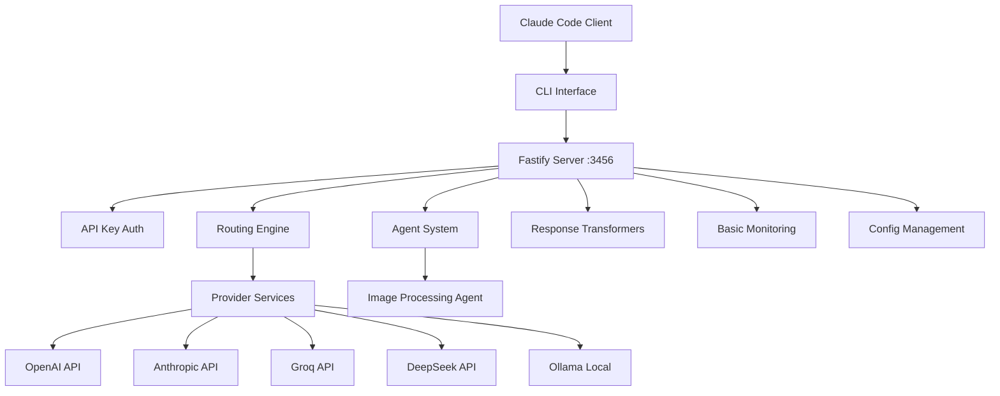
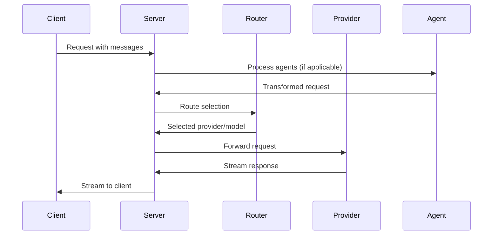
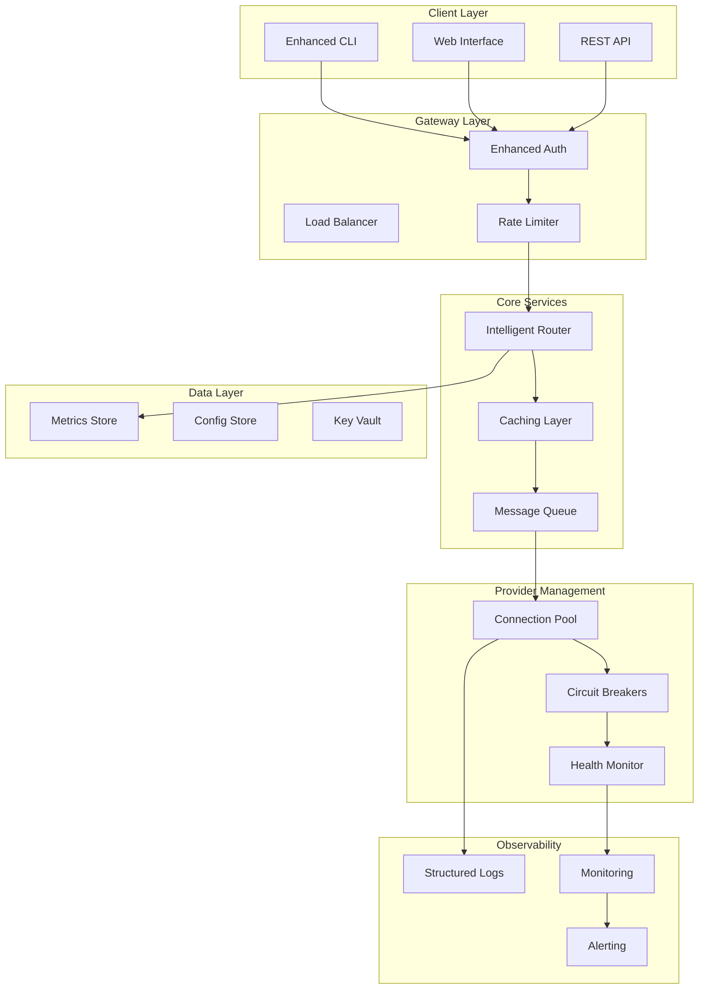
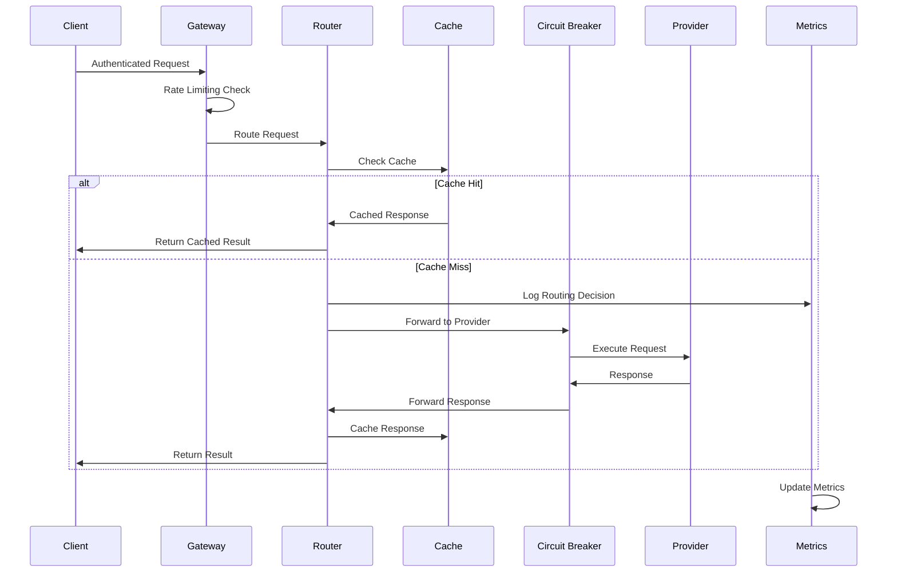

# Technical Architecture Enhancements Guide

## Overview

This document provides detailed technical specifications for enhancing the Claude Code Router architecture. It includes architectural diagrams, design patterns, API specifications, and implementation details for transforming the current system into an enterprise-grade AI routing platform.

## Current Architecture Analysis

### System Overview



### Current Component Analysis

#### Core Components (`src/`)
- **CLI Interface** (`cli.ts` - 322 lines): Process management, command handling
- **Server Core** (`server.ts` - 245 lines): Fastify server with API endpoints
- **Main Service** (`index.ts` - 381 lines): Request processing and stream handling
- **Router Engine** (`utils/router.ts` - 185 lines): Model selection logic
- **Agent System** (`agents/` - 233 total lines): Extensible agent architecture

#### Current Data Flow


### Identified Bottlenecks

1. **Type Safety**: Extensive use of `any` types in critical paths
2. **Performance**: No connection pooling, missing caching layer
3. **Reliability**: Basic error handling, no circuit breakers
4. **Observability**: Inconsistent logging, limited metrics
5. **Scalability**: Single-threaded processing, no load balancing

## Enhanced Architecture Design

### Target Architecture



### Enhanced Data Flow



## Core Enhancement Specifications

### 1. Type Safety Architecture

#### Type System Design

```typescript
// Core Domain Types
interface Message {
  readonly role: 'user' | 'assistant' | 'system';
  readonly content: string | ContentBlock[];
  readonly timestamp: Date;
}

interface ContentBlock {
  readonly type: 'text' | 'image' | 'tool_use' | 'tool_result';
  readonly data: TextContent | ImageContent | ToolUseContent | ToolResultContent;
}

// Provider Abstractions
abstract class Provider {
  abstract readonly name: string;
  abstract readonly models: readonly string[];
  abstract readonly capabilities: ProviderCapabilities;

  abstract async sendRequest(request: ProviderRequest): Promise<ProviderResponse>;
  abstract transformRequest(request: RouterRequest): ProviderRequest;
  abstract transformResponse(response: ProviderResponse): RouterResponse;
}

// Router Types
interface RoutingContext {
  readonly request: RouterRequest;
  readonly session: SessionContext;
  readonly constraints: RoutingConstraints;
  readonly history: RoutingHistory;
}

type RoutingDecision = {
  readonly provider: string;
  readonly model: string;
  readonly confidence: number;
  readonly reasoning: string;
  readonly fallbacks: readonly string[];
};

// Configuration Types
interface RouterConfig {
  readonly server: ServerConfig;
  readonly providers: readonly ProviderConfig[];
  readonly routing: RoutingConfig;
  readonly security: SecurityConfig;
  readonly monitoring: MonitoringConfig;
}
```

#### Generic Provider Interface

```typescript
// Generic Provider Implementation
class TypedProvider<TRequest, TResponse> implements Provider {
  constructor(
    private readonly config: ProviderConfig,
    private readonly httpClient: HttpClient,
    private readonly transformer: RequestTransformer<TRequest>,
    private readonly responseTransformer: ResponseTransformer<TResponse>
  ) {}

  async sendRequest(request: RouterRequest): Promise<RouterResponse> {
    const providerRequest = this.transformer.transform(request);
    const validation = this.validateRequest(providerRequest);

    if (!validation.valid) {
      throw new ValidationError('Invalid request', validation.errors);
    }

    const response = await this.httpClient.post<TResponse>(
      this.config.endpoint,
      providerRequest
    );

    return this.responseTransformer.transform(response);
  }

  private validateRequest(request: TRequest): ValidationResult {
    return this.requestSchema.validate(request);
  }
}
```

### 2. Performance Enhancement Architecture

#### Connection Pool Implementation

```typescript
// HTTP Connection Pool Manager
class ConnectionPoolManager {
  private readonly pools = new Map<string, http.Agent>();
  private readonly config: PoolConfig;

  constructor(config: PoolConfig) {
    this.config = config;
    this.initializePools();
  }

  private initializePools(): void {
    for (const provider of this.config.providers) {
      const agent = new http.Agent({
        keepAlive: true,
        maxSockets: provider.maxConnections || 10,
        maxFreeSockets: provider.maxFreeConnections || 5,
        timeout: provider.timeout || 30000,
        keepAliveMsecs: provider.keepAliveMsecs || 1000
      });

      this.pools.set(provider.name, agent);
    }
  }

  getPool(providerName: string): http.Agent {
    const pool = this.pools.get(providerName);
    if (!pool) {
      throw new Error(`No connection pool found for provider: ${providerName}`);
    }
    return pool;
  }

  async getPoolStats(): Promise<PoolStats[]> {
    return Array.from(this.pools.entries()).map(([name, agent]) => ({
      provider: name,
      activeSockets: agent.sockets ? Object.keys(agent.sockets).length : 0,
      freeSockets: agent.freeSockets ? Object.keys(agent.freeSockets).length : 0,
      requests: agent.requests ? Object.keys(agent.requests).length : 0
    }));
  }
}
```

#### Intelligent Caching Layer

```typescript
// Multi-Level Caching Architecture
class IntelligentCache {
  private readonly l1Cache: LRUCache<string, CacheEntry>; // Memory cache
  private readonly l2Cache: RedisCache; // Distributed cache
  private readonly strategy: CachingStrategy;

  constructor(config: CacheConfig) {
    this.l1Cache = new LRUCache({
      max: config.l1MaxItems,
      ttl: config.l1TTL,
      updateAgeOnGet: true
    });

    this.l2Cache = new RedisCache(config.redis);
    this.strategy = new CachingStrategy(config.strategy);
  }

  async get(key: string, context: CacheContext): Promise<CacheResult<any>> {
    // L1 Cache check
    const l1Result = this.l1Cache.get(key);
    if (l1Result && !this.isExpired(l1Result, context)) {
      return { hit: true, source: 'l1', data: l1Result.data };
    }

    // L2 Cache check
    const l2Result = await this.l2Cache.get(key);
    if (l2Result && !this.isExpired(l2Result, context)) {
      // Promote to L1
      this.l1Cache.set(key, l2Result);
      return { hit: true, source: 'l2', data: l2Result.data };
    }

    return { hit: false, source: 'none', data: null };
  }

  async set(key: string, data: any, context: CacheContext): Promise<void> {
    const entry = this.createCacheEntry(data, context);
    const ttl = this.strategy.calculateTTL(context);

    // Store in both levels
    this.l1Cache.set(key, entry, { ttl });
    await this.l2Cache.set(key, entry, ttl);
  }

  private createCacheKey(request: RouterRequest): string {
    const relevant = {
      model: request.body.model,
      messages: request.body.messages.slice(-5), // Last 5 messages
      system: request.body.system,
      temperature: request.body.temperature,
      max_tokens: request.body.max_tokens
    };

    return createHash('sha256')
      .update(JSON.stringify(relevant, this.sortKeys))
      .digest('hex');
  }

  private isExpired(entry: CacheEntry, context: CacheContext): boolean {
    return this.strategy.shouldExpire(entry, context);
  }
}

// Adaptive Caching Strategy
class CachingStrategy {
  calculateTTL(context: CacheContext): number {
    const baseTime = 15 * 60 * 1000; // 15 minutes

    // Adjust based on content type
    const contentMultiplier = this.getContentMultiplier(context.contentType);

    // Adjust based on user patterns
    const userMultiplier = this.getUserPatternMultiplier(context.userId);

    // Adjust based on provider performance
    const providerMultiplier = this.getProviderMultiplier(context.provider);

    return Math.floor(baseTime * contentMultiplier * userMultiplier * providerMultiplier);
  }

  shouldExpire(entry: CacheEntry, context: CacheContext): boolean {
    const age = Date.now() - entry.timestamp;
    const dynamicTTL = this.calculateTTL(context);

    return age > dynamicTTL;
  }

  private getContentMultiplier(contentType: ContentType): number {
    switch (contentType) {
      case 'static_info': return 2.0; // Cache longer for factual content
      case 'code_generation': return 1.5; // Moderate caching for code
      case 'conversation': return 0.5; // Short cache for dynamic content
      default: return 1.0;
    }
  }
}
```

### 3. Reliability & Resilience Architecture

#### Circuit Breaker Implementation

```typescript
// Advanced Circuit Breaker with Adaptive Thresholds
class AdaptiveCircuitBreaker {
  private state: CircuitBreakerState = CircuitBreakerState.CLOSED;
  private failures = 0;
  private successes = 0;
  private lastFailure = 0;
  private lastStateChange = 0;
  private readonly config: CircuitBreakerConfig;
  private readonly metrics: CircuitBreakerMetrics;

  constructor(config: CircuitBreakerConfig) {
    this.config = config;
    this.metrics = new CircuitBreakerMetrics();
  }

  async execute<T>(
    operation: () => Promise<T>,
    fallback?: () => Promise<T>
  ): Promise<T> {
    if (this.state === CircuitBreakerState.OPEN) {
      if (this.shouldAttemptReset()) {
        this.state = CircuitBreakerState.HALF_OPEN;
        this.lastStateChange = Date.now();
      } else {
        this.metrics.recordRejection();
        if (fallback) {
          return await fallback();
        }
        throw new CircuitBreakerOpenError('Circuit breaker is OPEN');
      }
    }

    try {
      const startTime = Date.now();
      const result = await this.executeWithTimeout(operation);
      const duration = Date.now() - startTime;

      this.onSuccess(duration);
      return result;
    } catch (error) {
      this.onFailure(error);

      if (fallback && this.state === CircuitBreakerState.OPEN) {
        return await fallback();
      }

      throw error;
    }
  }

  private async executeWithTimeout<T>(operation: () => Promise<T>): Promise<T> {
    return Promise.race([
      operation(),
      this.createTimeoutPromise()
    ]);
  }

  private onSuccess(duration: number): void {
    this.failures = 0;
    this.successes++;
    this.metrics.recordSuccess(duration);

    if (this.state === CircuitBreakerState.HALF_OPEN) {
      if (this.successes >= this.config.successThreshold) {
        this.state = CircuitBreakerState.CLOSED;
        this.lastStateChange = Date.now();
        this.successes = 0;
      }
    }
  }

  private onFailure(error: Error): void {
    this.failures++;
    this.lastFailure = Date.now();
    this.metrics.recordFailure(error);

    const threshold = this.calculateAdaptiveThreshold();

    if (this.failures >= threshold) {
      this.state = CircuitBreakerState.OPEN;
      this.lastStateChange = Date.now();
      this.failures = 0;
    }
  }

  private calculateAdaptiveThreshold(): number {
    const baseThreshold = this.config.failureThreshold;
    const recentPerformance = this.metrics.getRecentPerformance();

    // Adjust threshold based on historical performance
    if (recentPerformance.averageLatency > this.config.slowThreshold) {
      return Math.floor(baseThreshold * 0.7); // Lower threshold for slow responses
    }

    if (recentPerformance.errorRate > 0.1) {
      return Math.floor(baseThreshold * 0.8); // Lower threshold for high error rates
    }

    return baseThreshold;
  }
}

// Provider Health Monitor
class ProviderHealthMonitor {
  private readonly healthScores = new Map<string, HealthScore>();
  private readonly checkInterval: NodeJS.Timeout;
  private readonly providers: Provider[];

  constructor(providers: Provider[], config: HealthMonitorConfig) {
    this.providers = providers;
    this.checkInterval = setInterval(
      () => this.performHealthChecks(),
      config.intervalMs
    );
  }

  async performHealthChecks(): Promise<void> {
    const checks = this.providers.map(provider =>
      this.checkProviderHealth(provider)
    );

    await Promise.allSettled(checks);
    this.updateProviderRankings();
  }

  private async checkProviderHealth(provider: Provider): Promise<void> {
    const startTime = Date.now();

    try {
      const healthCheck = await this.executeHealthCheck(provider);
      const duration = Date.now() - startTime;

      const score = this.calculateHealthScore({
        latency: duration,
        success: true,
        responseTime: healthCheck.responseTime,
        errorRate: healthCheck.errorRate,
        availability: healthCheck.availability
      });

      this.healthScores.set(provider.name, score);
    } catch (error) {
      const score = this.calculateHealthScore({
        latency: Date.now() - startTime,
        success: false,
        error: error as Error
      });

      this.healthScores.set(provider.name, score);
    }
  }

  private calculateHealthScore(metrics: HealthMetrics): HealthScore {
    let score = 1.0;

    // Penalize high latency
    if (metrics.latency > 5000) score *= 0.5;
    else if (metrics.latency > 2000) score *= 0.8;

    // Penalize failures
    if (!metrics.success) score *= 0.3;

    // Consider error rate
    if (metrics.errorRate && metrics.errorRate > 0.05) {
      score *= (1 - metrics.errorRate);
    }

    // Consider availability
    if (metrics.availability && metrics.availability < 0.95) {
      score *= metrics.availability;
    }

    return {
      overall: Math.max(0, Math.min(1, score)),
      components: {
        latency: this.normalizeLatency(metrics.latency),
        availability: metrics.availability || (metrics.success ? 1 : 0),
        errorRate: 1 - (metrics.errorRate || 0),
        responseTime: metrics.responseTime ? this.normalizeResponseTime(metrics.responseTime) : 1
      },
      timestamp: Date.now(),
      trend: this.calculateTrend(metrics)
    };
  }
}
```

### 4. Intelligent Routing Architecture

#### ML-Based Router Implementation

```typescript
// Feature Engineering for Routing Decisions
class RoutingFeatureExtractor {
  extractFeatures(request: RouterRequest, context: RoutingContext): RoutingFeatures {
    return {
      // Request characteristics
      tokenCount: this.calculateTokenCount(request.body.messages),
      messageCount: request.body.messages.length,
      averageMessageLength: this.calculateAverageMessageLength(request.body.messages),

      // Content analysis
      complexity: this.analyzeComplexity(request.body.messages),
      contentType: this.classifyContent(request.body.messages),
      language: this.detectLanguage(request.body.messages),

      // Temporal features
      timeOfDay: new Date().getHours(),
      dayOfWeek: new Date().getDay(),
      seasonality: this.calculateSeasonality(),

      // User context
      userTier: context.session.userTier,
      historicalPreferences: context.history.getPreferences(),
      budgetConstraints: context.constraints.budget,

      // System context
      currentLoad: this.getCurrentSystemLoad(),
      providerHealth: this.getProviderHealthScores(),
      costEfficiency: this.getCurrentCostEfficiency()
    };
  }

  private analyzeComplexity(messages: Message[]): ComplexityScore {
    const indicators = {
      technicalTerms: this.countTechnicalTerms(messages),
      codeBlocks: this.countCodeBlocks(messages),
      questionComplexity: this.analyzeQuestionComplexity(messages),
      contextLength: this.calculateContextComplexity(messages)
    };

    return {
      overall: this.weightedComplexityScore(indicators),
      components: indicators
    };
  }

  private classifyContent(messages: Message[]): ContentClassification {
    const text = messages.map(m => typeof m.content === 'string' ? m.content : '').join(' ');

    const patterns = {
      coding: /\b(function|class|import|export|const|let|var|if|for|while)\b/gi,
      creative: /\b(story|poem|creative|imagine|artistic|design)\b/gi,
      analytical: /\b(analyze|compare|evaluate|assess|research|study)\b/gi,
      conversational: /\b(hello|hi|how are you|thank you|please)\b/gi
    };

    const scores = Object.entries(patterns).map(([category, pattern]) => ({
      category,
      score: (text.match(pattern) || []).length / text.length * 1000
    }));

    const dominant = scores.reduce((prev, current) =>
      current.score > prev.score ? current : prev
    );

    return {
      primaryType: dominant.category as ContentType,
      confidence: Math.min(1, dominant.score),
      scores: Object.fromEntries(scores.map(s => [s.category, s.score]))
    };
  }
}

// Intelligent Router with ML and Cost Optimization
class IntelligentRouter {
  private readonly featureExtractor: RoutingFeatureExtractor;
  private readonly costOptimizer: CostOptimizer;
  private readonly performancePredictor: PerformancePredictor;
  private readonly decisionCache: LRUCache<string, RoutingDecision>;

  constructor(
    featureExtractor: RoutingFeatureExtractor,
    costOptimizer: CostOptimizer,
    performancePredictor: PerformancePredictor
  ) {
    this.featureExtractor = featureExtractor;
    this.costOptimizer = costOptimizer;
    this.performancePredictor = performancePredictor;
    this.decisionCache = new LRUCache({ max: 1000, ttl: 5 * 60 * 1000 });
  }

  async selectOptimalProvider(
    request: RouterRequest,
    context: RoutingContext
  ): Promise<RoutingDecision> {
    // Check cache for similar requests
    const cacheKey = this.createDecisionCacheKey(request);
    const cachedDecision = this.decisionCache.get(cacheKey);

    if (cachedDecision && this.isCachedDecisionValid(cachedDecision, context)) {
      return cachedDecision;
    }

    // Extract features
    const features = this.featureExtractor.extractFeatures(request, context);

    // Get candidate providers
    const candidates = this.getCandidateProviders(features, context);

    // Predict performance for each candidate
    const predictions = await Promise.all(
      candidates.map(async candidate => ({
        provider: candidate,
        performance: await this.performancePredictor.predict(features, candidate),
        cost: this.costOptimizer.estimateCost(features, candidate)
      }))
    );

    // Select optimal provider based on multi-criteria optimization
    const decision = this.optimizeProviderSelection(predictions, context.constraints);

    // Cache the decision
    this.decisionCache.set(cacheKey, decision);

    // Learn from this decision for future improvements
    this.schedulePerformanceFeedback(decision, request, context);

    return decision;
  }

  private optimizeProviderSelection(
    predictions: ProviderPrediction[],
    constraints: RoutingConstraints
  ): RoutingDecision {
    // Multi-criteria decision making using weighted scoring
    const scored = predictions.map(pred => ({
      ...pred,
      score: this.calculateProviderScore(pred, constraints)
    }));

    // Sort by score and apply constraints
    const viable = scored
      .filter(p => this.meetsConstraints(p, constraints))
      .sort((a, b) => b.score - a.score);

    if (viable.length === 0) {
      throw new Error('No viable providers meet the specified constraints');
    }

    const selected = viable[0];

    return {
      provider: selected.provider.name,
      model: this.selectOptimalModel(selected.provider, predictions),
      confidence: selected.score,
      reasoning: this.generateReasoning(selected, constraints),
      fallbacks: viable.slice(1, 4).map(v => v.provider.name),
      estimatedCost: selected.cost,
      estimatedLatency: selected.performance.latency,
      expectedQuality: selected.performance.quality
    };
  }

  private calculateProviderScore(
    prediction: ProviderPrediction,
    constraints: RoutingConstraints
  ): number {
    const weights = constraints.optimization || {
      cost: 0.3,
      latency: 0.3,
      quality: 0.4
    };

    // Normalize metrics to 0-1 scale
    const costScore = 1 - Math.min(1, prediction.cost / constraints.maxCost);
    const latencyScore = 1 - Math.min(1, prediction.performance.latency / constraints.maxLatency);
    const qualityScore = prediction.performance.quality;

    return (
      costScore * weights.cost +
      latencyScore * weights.latency +
      qualityScore * weights.quality
    );
  }

  private async schedulePerformanceFeedback(
    decision: RoutingDecision,
    request: RouterRequest,
    context: RoutingContext
  ): Promise<void> {
    // Schedule feedback collection after request completion
    setTimeout(async () => {
      try {
        await this.collectPerformanceFeedback(decision, request, context);
      } catch (error) {
        console.error('Failed to collect performance feedback:', error);
      }
    }, 30000); // Collect feedback after 30 seconds
  }
}
```

### 5. Security Architecture Enhancements

#### Advanced Authentication & Authorization

```typescript
// JWT-based Authentication with Role-Based Access Control
class EnhancedAuthenticationManager {
  private readonly jwtManager: JWTManager;
  private readonly roleManager: RoleManager;
  private readonly auditLogger: AuditLogger;

  constructor(config: AuthConfig) {
    this.jwtManager = new JWTManager(config.jwt);
    this.roleManager = new RoleManager(config.roles);
    this.auditLogger = new AuditLogger(config.audit);
  }

  async authenticate(request: FastifyRequest): Promise<AuthContext> {
    const token = this.extractToken(request);

    if (!token) {
      throw new UnauthorizedError('No authentication token provided');
    }

    const payload = await this.jwtManager.verify(token);
    const user = await this.loadUserContext(payload.userId);

    // Check if user account is active
    if (!user.isActive) {
      throw new ForbiddenError('User account is deactivated');
    }

    // Log authentication event
    await this.auditLogger.log({
      event: 'authentication',
      userId: user.id,
      ip: request.ip,
      userAgent: request.headers['user-agent'],
      timestamp: new Date()
    });

    return {
      user,
      permissions: await this.roleManager.getUserPermissions(user.id),
      sessionId: payload.sessionId
    };
  }

  async authorize(context: AuthContext, resource: string, action: string): Promise<void> {
    const hasPermission = await this.roleManager.checkPermission(
      context.user.id,
      resource,
      action
    );

    if (!hasPermission) {
      await this.auditLogger.log({
        event: 'authorization_failed',
        userId: context.user.id,
        resource,
        action,
        timestamp: new Date()
      });

      throw new ForbiddenError(`Insufficient permissions for ${action} on ${resource}`);
    }
  }
}

// Secure Key Management with Vault Integration
class SecureKeyManager {
  private readonly vaultClient: VaultClient;
  private readonly encryptionService: EncryptionService;
  private readonly keyRotationScheduler: KeyRotationScheduler;

  constructor(config: KeyManagementConfig) {
    this.vaultClient = new VaultClient(config.vault);
    this.encryptionService = new EncryptionService(config.encryption);
    this.keyRotationScheduler = new KeyRotationScheduler(config.rotation);
  }

  async getProviderKey(provider: string, userId?: string): Promise<string> {
    const keyPath = this.buildKeyPath(provider, userId);

    try {
      const encrypted = await this.vaultClient.read(keyPath);
      return this.encryptionService.decrypt(encrypted.data.key);
    } catch (error) {
      throw new KeyRetrievalError(`Failed to retrieve key for provider ${provider}`, error);
    }
  }

  async rotateKey(provider: string): Promise<void> {
    const newKey = await this.generateNewKey(provider);
    const keyPath = this.buildKeyPath(provider);

    // Store new key
    await this.vaultClient.write(keyPath, {
      key: this.encryptionService.encrypt(newKey),
      createdAt: new Date().toISOString(),
      rotationId: generateUUID()
    });

    // Test new key
    await this.validateKey(provider, newKey);

    // Schedule old key cleanup
    this.scheduleKeyCleanup(provider, keyPath);
  }

  async validateKey(provider: string, key: string): Promise<boolean> {
    const testRequest = this.createTestRequest(provider);

    try {
      await this.makeTestCall(provider, key, testRequest);
      return true;
    } catch (error) {
      throw new KeyValidationError(`Key validation failed for ${provider}`, error);
    }
  }

  private scheduleKeyCleanup(provider: string, keyPath: string): void {
    setTimeout(async () => {
      try {
        await this.vaultClient.delete(`${keyPath}_old`);
      } catch (error) {
        console.error(`Failed to cleanup old key for ${provider}:`, error);
      }
    }, this.keyRotationScheduler.getCleanupDelay());
  }
}
```

### 6. Monitoring & Observability Architecture

#### Comprehensive Metrics Collection

```typescript
// Advanced Metrics Collection System
class MetricsCollectionSystem {
  private readonly prometheus: PrometheusRegistry;
  private readonly collectors: Map<string, MetricCollector>;
  private readonly aggregator: MetricsAggregator;

  constructor(config: MetricsConfig) {
    this.prometheus = new PrometheusRegistry();
    this.collectors = new Map();
    this.aggregator = new MetricsAggregator(config.aggregation);

    this.setupMetrics();
  }

  private setupMetrics(): void {
    // Request metrics
    this.collectors.set('requests', new Counter({
      name: 'router_requests_total',
      help: 'Total number of requests processed',
      labelNames: ['provider', 'model', 'status', 'user_tier', 'content_type']
    }));

    // Latency metrics
    this.collectors.set('latency', new Histogram({
      name: 'router_request_duration_seconds',
      help: 'Request duration in seconds',
      labelNames: ['provider', 'model', 'cache_status'],
      buckets: [0.01, 0.05, 0.1, 0.5, 1, 2, 5, 10, 30, 60]
    }));

    // Cost tracking
    this.collectors.set('cost', new Counter({
      name: 'router_cost_total_usd',
      help: 'Total cost in USD',
      labelNames: ['provider', 'model', 'user_id']
    }));

    // Quality metrics
    this.collectors.set('quality', new Gauge({
      name: 'router_response_quality_score',
      help: 'Response quality score (0-1)',
      labelNames: ['provider', 'model']
    }));

    // System metrics
    this.collectors.set('memory', new Gauge({
      name: 'router_memory_usage_bytes',
      help: 'Memory usage in bytes'
    }));

    // Cache metrics
    this.collectors.set('cache', new Counter({
      name: 'router_cache_operations_total',
      help: 'Cache operations (hit/miss)',
      labelNames: ['operation', 'level']
    }));
  }

  recordRequest(
    provider: string,
    model: string,
    status: string,
    duration: number,
    cost: number,
    context: RequestContext
  ): void {
    const labels = {
      provider,
      model,
      status,
      user_tier: context.userTier,
      content_type: context.contentType
    };

    this.collectors.get('requests')!.inc(labels);
    this.collectors.get('latency')!.observe(labels, duration);

    if (cost > 0) {
      this.collectors.get('cost')!.inc({ provider, model, user_id: context.userId }, cost);
    }
  }

  recordQualityScore(provider: string, model: string, score: number): void {
    this.collectors.get('quality')!.set({ provider, model }, score);
  }

  async generateReport(): Promise<MetricsReport> {
    const metrics = await this.aggregator.aggregate();

    return {
      timestamp: new Date(),
      summary: {
        totalRequests: metrics.requests.total,
        averageLatency: metrics.latency.average,
        totalCost: metrics.cost.total,
        averageQuality: metrics.quality.average
      },
      providers: await this.generateProviderAnalytics(metrics),
      users: await this.generateUserAnalytics(metrics),
      trends: await this.generateTrendAnalysis(metrics),
      recommendations: await this.generateRecommendations(metrics)
    };
  }

  private async generateProviderAnalytics(metrics: AggregatedMetrics): Promise<ProviderAnalytics[]> {
    return Object.entries(metrics.byProvider).map(([provider, data]) => ({
      name: provider,
      requestCount: data.requests,
      averageLatency: data.latency.average,
      successRate: data.successRate,
      totalCost: data.cost,
      costPerRequest: data.cost / data.requests,
      qualityScore: data.quality.average,
      availability: data.availability,
      trend: this.calculateProviderTrend(provider, data)
    }));
  }
}

// Real-time Alerting System
class AlertingSystem {
  private readonly rules: AlertRule[];
  private readonly channels: NotificationChannel[];
  private readonly stateManager: AlertStateManager;

  constructor(config: AlertingConfig) {
    this.rules = config.rules.map(rule => new AlertRule(rule));
    this.channels = config.channels.map(ch => this.createChannel(ch));
    this.stateManager = new AlertStateManager();
  }

  async evaluateMetrics(metrics: MetricsSnapshot): Promise<void> {
    for (const rule of this.rules) {
      const result = await rule.evaluate(metrics);

      if (result.triggered) {
        await this.handleAlert(rule, result, metrics);
      } else {
        await this.handleRecovery(rule, metrics);
      }
    }
  }

  private async handleAlert(
    rule: AlertRule,
    result: AlertResult,
    metrics: MetricsSnapshot
  ): Promise<void> {
    const alertKey = rule.getName();
    const existingAlert = this.stateManager.getAlert(alertKey);

    if (!existingAlert) {
      // New alert
      const alert = {
        id: generateUUID(),
        rule: rule.getName(),
        severity: rule.getSeverity(),
        message: result.message,
        context: result.context,
        timestamp: new Date(),
        metrics: this.extractRelevantMetrics(metrics, rule)
      };

      await this.sendAlert(alert);
      this.stateManager.setAlert(alertKey, alert);
    } else {
      // Update existing alert if conditions changed
      if (this.shouldUpdateAlert(existingAlert, result)) {
        existingAlert.message = result.message;
        existingAlert.context = result.context;
        existingAlert.timestamp = new Date();

        await this.sendAlertUpdate(existingAlert);
      }
    }
  }

  private async sendAlert(alert: Alert): Promise<void> {
    const applicableChannels = this.channels.filter(ch =>
      ch.shouldHandle(alert.severity, alert.rule)
    );

    await Promise.all(
      applicableChannels.map(channel => channel.sendAlert(alert))
    );
  }
}
```

## Implementation Guidelines

### 1. Migration Strategy

#### Phase-based Implementation

```typescript
// Migration Orchestrator
class MigrationOrchestrator {
  private readonly phases: MigrationPhase[];
  private readonly validator: MigrationValidator;
  private readonly rollbackManager: RollbackManager;

  constructor(config: MigrationConfig) {
    this.phases = this.buildMigrationPhases(config);
    this.validator = new MigrationValidator();
    this.rollbackManager = new RollbackManager();
  }

  async executeMigration(): Promise<MigrationResult> {
    for (const phase of this.phases) {
      try {
        console.log(`Starting migration phase: ${phase.name}`);

        // Pre-migration validation
        await this.validator.validatePreConditions(phase);

        // Create rollback point
        const rollbackPoint = await this.rollbackManager.createCheckpoint(phase);

        // Execute phase
        const result = await phase.execute();

        // Post-migration validation
        await this.validator.validatePostConditions(phase, result);

        console.log(`Completed migration phase: ${phase.name}`);

        if (phase.requiresRestart) {
          console.log('Phase requires service restart');
          // Handle service restart logic
        }

      } catch (error) {
        console.error(`Migration phase ${phase.name} failed:`, error);
        await this.rollbackManager.rollback(phase);
        throw new MigrationError(`Migration failed at phase ${phase.name}`, error);
      }
    }

    return {
      success: true,
      phasesCompleted: this.phases.length,
      duration: this.calculateMigrationDuration(),
      summary: this.generateMigrationSummary()
    };
  }
}
```

### 2. Testing Strategy

#### Comprehensive Test Architecture

```typescript
// Integration Test Framework
class EnhancementTestSuite {
  private readonly testEnvironment: TestEnvironment;
  private readonly mockProviders: MockProviderManager;
  private readonly performanceMonitor: PerformanceMonitor;

  async runTypeSystemTests(): Promise<TestResult[]> {
    return [
      await this.testTypeInference(),
      await this.testGenericProviders(),
      await this.testValidationSchemas(),
      await this.testErrorHandling()
    ];
  }

  async runPerformanceTests(): Promise<PerformanceTestResult[]> {
    return [
      await this.testConnectionPooling(),
      await this.testCachingPerformance(),
      await this.testConcurrentRequests(),
      await this.testMemoryUsage()
    ];
  }

  async runReliabilityTests(): Promise<ReliabilityTestResult[]> {
    return [
      await this.testCircuitBreaker(),
      await this.testProviderFailover(),
      await this.testHealthMonitoring(),
      await this.testGracefulDegradation()
    ];
  }

  private async testCircuitBreaker(): Promise<TestResult> {
    const circuitBreaker = new AdaptiveCircuitBreaker(this.testConfig.circuitBreaker);

    // Test normal operation
    let normalOperations = 0;
    for (let i = 0; i < 10; i++) {
      try {
        await circuitBreaker.execute(() => this.mockSuccessfulOperation());
        normalOperations++;
      } catch (error) {
        // Should not happen in normal operation
      }
    }

    // Test failure scenarios
    let failedOperations = 0;
    for (let i = 0; i < 5; i++) {
      try {
        await circuitBreaker.execute(() => this.mockFailingOperation());
      } catch (error) {
        failedOperations++;
      }
    }

    // Test circuit opening
    let circuitOpenRejections = 0;
    for (let i = 0; i < 3; i++) {
      try {
        await circuitBreaker.execute(() => this.mockSuccessfulOperation());
      } catch (error) {
        if (error instanceof CircuitBreakerOpenError) {
          circuitOpenRejections++;
        }
      }
    }

    return {
      name: 'Circuit Breaker Functionality',
      passed: normalOperations === 10 && failedOperations === 5 && circuitOpenRejections === 3,
      details: {
        normalOperations,
        failedOperations,
        circuitOpenRejections
      }
    };
  }
}
```

## Deployment Architecture

### Container Orchestration

```yaml
# docker-compose.yml for Enhanced Architecture
version: '3.8'
services:
  router:
    image: claude-code-router:enhanced
    ports:
      - "3456:3456"
    environment:
      - NODE_ENV=production
      - REDIS_URL=redis://redis:6379
      - VAULT_URL=http://vault:8200
    depends_on:
      - redis
      - vault
      - prometheus

  redis:
    image: redis:7-alpine
    volumes:
      - redis_data:/data

  vault:
    image: vault:latest
    environment:
      - VAULT_DEV_ROOT_TOKEN_ID=dev-token
    volumes:
      - vault_data:/vault/data

  prometheus:
    image: prom/prometheus:latest
    ports:
      - "9090:9090"
    volumes:
      - ./prometheus.yml:/etc/prometheus/prometheus.yml
      - prometheus_data:/prometheus

  grafana:
    image: grafana/grafana:latest
    ports:
      - "3000:3000"
    environment:
      - GF_SECURITY_ADMIN_PASSWORD=admin
    volumes:
      - grafana_data:/var/lib/grafana

volumes:
  redis_data:
  vault_data:
  prometheus_data:
  grafana_data:
```

This comprehensive technical architecture guide provides the foundation for implementing all the enhancements identified in the analysis. Each component is designed to be modular, testable, and scalable, ensuring the enhanced Claude Code Router can serve as an enterprise-grade AI routing platform.